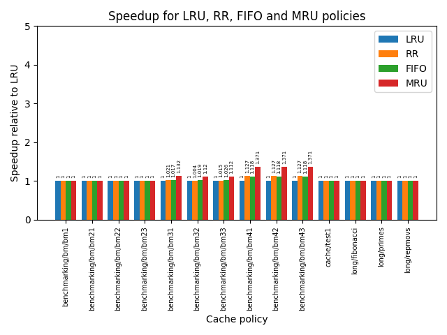
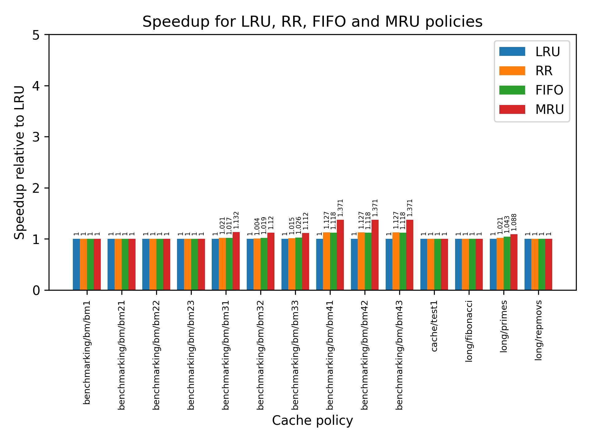

# Report Guillaume Thivolet - guillaume@glabs.ch

<div style="text-align: justify">

## Experiment setup, benchmark generation

I automated the benchmarking using python. Below is an explanation of all actions that are required to reproduce my work.

The `run_benchmarks.py` script has to be modified in order to change which parameter we are currently sweeping. Only the function being swept should be uncommented in the main function.

As the run_benchmarks.py program passes the argument being tested to the program, the c files also require some changes in order to accept this additional parameter.

There are listed just below. In `pipe.c`, the passed parameter from the console line argument should be used correctly in the cache initialization in relation to the parameter that we are testing.

`pipe.c, pipe_init()`

```c
void pipe_init(int param) {
	memset(&pipe, 0, sizeof(Pipe_State));
	pipe.PC = 0x00400000;

	instruction_cache = cache_init(1 << 13, 32, 4);
	data_cache        = cache_init(1 << 16, param, 8); testing block size
	//data_cache        = cache_init(1 << 16, 32, param); testing associativity
	//data_cache        = cache_init(1 << (10 + 31 - __builtin_clzl((uint32_t)param)), 32, 8); testing cache size
}
```

`shell.c, main`

```c
int main(int argc, char *argv[]) {

	/* Error Checking */
	if (argc < 2) {
		printf("Error: usage: %s <program_file_1> <program_file_2> ...\n",
		       argv[0]);
		exit(1);
	}

	printf("MIPS Simulator\n\n");

	initialize(strtol(argv[1], NULL, 10), argv[2], argc - 1);

	while (1)
		get_command();
}
```

`shell.c, initialize`

```c
void initialize(int param, char *program_filename, int num_prog_files) {
	int i;

	init_memory();

	pipe_init(param);
	for (i = 1; i < num_prog_files; i++) {
		load_program(program_filename);
		while (*program_filename++ != '\0')
			;
	}

	RUN_BIT = TRUE;
}
```

In `inputs/benchmarking/`, a Makefile is provided to generate the benchmarks object files and to subsequently run the automated tests on the simulator. The user must install the cross-compilation MIPS toolchain on his Linux first. I suggest to fetch it through the debian package manager:

```bash
sudo apt install binutils-mips-linux-gnu
```

__Possible usages are:__

- `make` to generate both benchmarks
- `make run_tests` to run the tests through the simulator

## Cache exploration by sweeping parameters

I was interested in optimizing the data cache regardless of the instruction cache and then the other way around.

There's a streaming pattern benchmark and a random access one for both caches. For the data cache, Benchmark 3 and 4 are dedicated to testing cache eviction policies. 

For each of those benchmarks, I generate 100 of them so that the benchmarking is less impacted by our program but rather gives an IPC that would be closer to reality.

For each parameter that I am testing (block size, associativity, cache size), I ran both benchmarks' 100 programs generated and reported the average IPC in a bar chart. This will help in determining the sweet point of the curve.

__In retrospective, it probably would have lead to more interesting results to add more diversified benchmarks (more than two types), but designing tests is very time-consuming and I will leave it for later (or another lab).__

### Benchmark program 1

The first program streams the memory sequentially with an increment of 4 bytes on the address pointer between each access, and copies the accessed value in another array further in the memory.
The variant is in regard to the number of copies that we do (initial `addiu $s2, $0, 0xXXX` value). Below is an example program.

```asm
.text
    lui $s0, 0x1000
    lui $s1, 0x2000
    addiu $s2, $0, 0x4e9
loop:
    lw $t0, 0($s0)
    sw $t0, 0($s1)
    addiu $s0, $s0, 0x4
    addiu $s1, $s1, 0x4
    addiu $s2, $s2, -1
    nop
    nop
    bnez $s2, loop
    addiu $v0, $0, 10
    syscall
```

Generation details can be found in `inputs/benchmarking/generate_benchmarks.py`.

### Benchmark program 2

The second program generate `n` random accesses in the memory and copies the accessed value in another array.
The number of access is in the range of `[10;2000]`. Examples programs are longer than for the benchmark 1 as all the access are hardcoded and there's no loop. Below is an extract of a generated program.

```asm
.text
    lui $s0, 0x1000
    lui $s1, 0x3000
    addiu $s2, $s0, 0x3c
    lw $t0, 0($s2)
    addiu $s2, $s1, 0x80
    sw $t0, 0($s2)
    addiu $s2, $s0, 0xb8
    lw $t0, 0($s2)
    addiu $s2, $s1, 0x70
    sw $t0, 0($s2)
    addiu $s2, $s0, 0xe0
    lw $t0, 0($s2)
    .....
    addiu $v0, $0, 10
    syscall
```

Generation details can be found in `inputs/benchmarking/generate_benchmarks.py`.

### Benchmark program 3&4

The third benchmark generates 100 consecutive random sequences of 8 accesses to the same set with different tags. A sequence could be `0, 1, 2, 3, 4, 3, 4, 2`. I designed this test for a 4-way cache to specifically test out the effect of eviction policy. Benchmark 4 is a variant where the probability of hitting multiple times the same address is 1.5 higher. There are also 500 sequences instead of 100.

```asm
.text
    lui $s0, 0x1000
    lui $s1, 0x3
    addu $s2, $s1, $s0
    lw $t0, 0($s2)
    lui $s1, 0x5
    addu $s2, $s1, $s0
    lw $t0, 0($s2)
    lui $s1, 0x2
    addu $s2, $s1, $s0
    lw $t0, 0($s2)
    lui $s1, 0x1
    addu $s2, $s1, $s0
    .....
    addiu $v0, $0, 10
    syscall
```

Generation details can be found in `inputs/benchmarking/generate_benchmarks.py`.

### Benchmark program 5

This benchmark is for programs that call chained functions. In the benchmark, there are 10 functions generated, which each have different sizes (between 20 and 400 instructions `nop`). Each function calls the next function in a random order.

```asm
.text
fn_0:
    nop
    nop
    nop
    nop
    nop
    ...
    nop
    beqz $0, fn_4
fn_1:
    nop
    nop
    .....
    addiu $v0, $0, 10
    syscall
```

Generation details can be found in `inputs/benchmarking/generate_benchmarks.py`.

### Benchmark program 6

BM6 is intended to simulate programs that regularly call the same functions. It generates 4 functions of random sizes (filled with 'nop'), and calls each of those in a random order multiple times, until we reach the end after a empirical amount of calls (defined at generation). In between the functions there are `nop` instructions to space out the functions locality and not rely too much on block size.

Below is an extract of a generated program.

```asm
.text
    addiu $t0, $0, 100
    addiu $t1, $0, 1
    addiu $t2, $0, 2
    addiu $t3, $0, 3
fn_main:
    and $t4, $t0, $t3
    nop
    nop
    blez $t0, end
    nop
    nop
    beq $t4, $0, fn_0
    nop
    nop
    beq $t4, $t1, fn_1
    nop
    nop
    beq $t4, $t2, fn_2
    nop
    nop
    beq $t4, $t3, fn_3
end:
    addiu $v0, $0, 10
    syscall
    nop
    nop
    .....
    addiu $v0, $0, 10
    syscall
```

Generation details can be found in `inputs/benchmarking/generate_benchmarks.py`.


## Instruction cache exploration

### Block size
<p align="center">

</p>

The other parameters were: 8-ways, 8KB Cache size.

For both BM5 and BM6, the bigger the block size the higher is the average IPC. For Benchmark 6 it seems to reach a threshold because the functions are fart apart from each other in the cache, so after 256 the improvement starts to be less noticeable. Benchmark 5 benefits much more from the block size as the program is shorter.

An acceptable compromise would be **64 B or 128 B** for the block size, otherwise it just becomes too large to be actually implementable and is not reasonable.


### Cache size
<p align="center">

</p>

For a fixed 8-ways configuration, and 32B of block size, the cache size has most importance for BM6 as it is a shorter program. BM5 reaches further so the changing cache size alone doesn't help too much. 

The results shown here could probably be more relevant is the pattern access was different (with more written tests), and it would be easier to draw a conclusion from the plot.

For now, I would pick a cache of __8KB__.

### Associativity
<p align="center">

</p>

If we increment the associativity (more tags can be stored per set), the performance improvement stalls after 2 ways for BM5 and BM6. As programs are usually not likely to jump away very far (ie.PC0), I would suggest to keep a low associativity of 4 otherwise for some other benchmarks it could hurt the performances.

Only one 1-way would be equivalent to a direct-mapped cache,  and too many ways would require additional logic (more area-consuming logic on the die as well as more combinational logic). I would stick to a  __4-ways associative cache__, .

## Data cache exploration

### Block size

Example of execution in the terminal:
<p align="center">


</p>

The other parameters were: 8-ways, 64KB Cache size.

The bigger the block size, the better the access performance for the sequential program (BM1), which is to be expected. Regarding BM2, which has a random access pattern, it is notable that after a certain block size it doesn't help much because the addresses are too far apart anyways. Same reasoning for BM3.

An acceptable compromise would be **64 B or 128 B** for the block size, otherwise it just becomes too large to be actually implementable and is not reasonable.

### Cache size

<p align="center">

</p>
For a fixed 8-ways configuration, and 32B of block size, there is no improvement for a streaming pattern if the cache size increases and neither for BM2 nor BM3. The hits or miss don't depend on the cache size (unless oversized) in this case, but more on the block size.  

The results shown here could probably be more relevant is the pattern access was different (with more written tests), and it would be easier to draw a conclusion from the plot.

For now, I would pick a cache of __64KB__.

### Number of sets (associativity)

<p align="center">

</p>

If we increment the associativity (more tags can be stored per set), the performance improvement stalls after 2 ways for BM2 and BM1. This is normal since for BM1 it uses two ways at most and the block size is the only parameter 

The streaming pattern BM1 sees a performance improvement stall after 2 ways. This is because it loads in each set needs to be stored consecutively the load and store addresses. One way is clearly not enough as it needs to reload the block after each load or store. After 2 ways, not much can be done except than having a larger block size to improve performance as it will anyway need to reach the next set.

Concerning BM2, the accesses are random so the number of ways has no importance on the average IPC.

However, for BM3 (which is designed for a 4-way cache policy testing) we can see that the performance increase until we reach 8 ways. This is expected as with 8 ways it stores all the accessed addresses in the cache and never has to load them.

Only one 1-way would be equivalent to a direct-mapped cache,  and too many ways would require additional logic (more area-consuming logic on the die as well as more combinational logic). I would stick to a number between __between 4 and 16__, depending on the cache level.

## Cache replacement policy exploration

The following policies have been tested:

- Least-Recently Used (LRU)
- Random Replacement (RR)
- Most-recently Used (MRU)
- FIFO

For each of them I ran a simulation on some benchmarks provided as well as a few tests generated by BM2, BM3 and BM4. There are two configurations of data cache and an instruction cache of The graph below shows the average cycles speedup for each program against the baseline LRU. 

It hard to attain a conclusion from the plots as we see no difference with LRU for most of the simulations (accesses being mostly random and never targeting more than once the same cache block). 

It is important to note that MRU reaches the best speedup (37.1%) in the case of BM4 in both setup 1 and 2, due to the pattern access which reaccesses older elements sparsely enough to gain benefit from MRU. As BM3 is a variation of BM4 which focused towards the testing of cache policy, so it is normal that the speedup is slightly less for BM3 than for BM4.

For future work, testing more programs would probably lead to different conclusion for the cache policies (ie. instruction cache focused), so I decided to leave out LRU in my most performing design.


##### Setup 1
- **Data cache** *cache size 64kB, 32B block size, 4-ways associative*
- **Instruction cache** *cache size 8kB, 32B blocks, 4-ways* associative 

<p align="center">

</p>

##### Setup 2 
- **Data cache** *cache size 16kB, 4B block size, 4-ways associative*
- **Instruction cache** *cache size 8kB, 32B blocks, 4-ways* associative 

<p align="center">

</p>

</div>