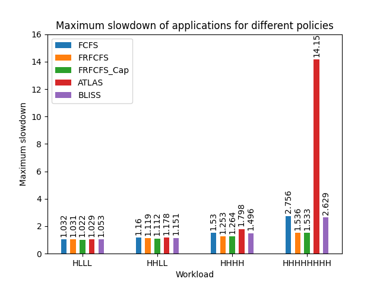
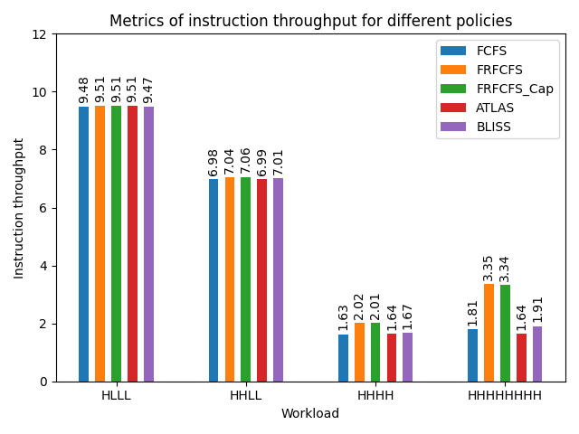
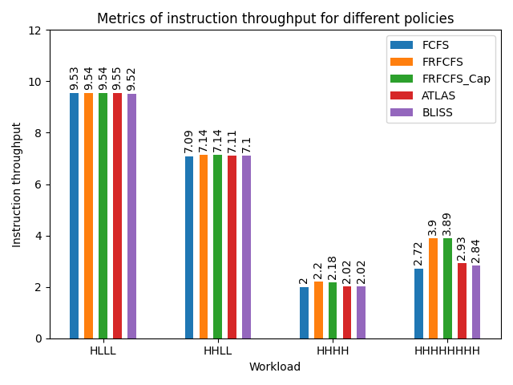

# Report Guillaume Thivolet - guillaume@glabs.ch

<div style="text-align: justify">

## Implementation details

Both policies have been implemented in `Scheduler.h`.

The two following sections describe additional changes for ATLAS and BLISS.

#### ATLAS

In `Controller.h`, I added the local LAS ranks array and the meta-controller ranks array to store ranks from the previous quantum. The tick() function also now includes the attained service counter for each thread. 

```cpp
	void tick() {
  ...
  	-> local_las_ranks[req->coreid]++;
		queue->q.erase(req);
  }
```

In `Memory.h`, I implemented the meta-controller as such in `tick()`.

```cpp
void tick() {
    ...
		if ((cycles % quantum_length) == 0) {
			vector<int> tmp_ranks;
			tmp_ranks.resize(num_cores, 0);

			for (auto ctrl : ctrls) {
				for (int i = 0; i < ctrl->local_las_ranks.size(); i++) {
					tmp_ranks[i] += ctrl->local_las_ranks[i];
					ctrl->local_las_ranks[i] = 0;
				}
			}

			for (size_t i = 0; i < num_cores; i++) {
				meta_las_ranks[i] = meta_las_ranks[i] * alpha + (1 - alpha) * tmp_ranks[i];
			}

			for (auto ctrl : ctrls) {
				ctrl->meta_las_ranks = meta_las_ranks;
			}
		}
    ...
```

#### BLISS

The blacklisting mechanism has been added in the function `void tick()` of  `Controller.h`, as such:

```cpp
		... // find a request to schedule
		//BLISS policy
		if (req->coreid != application_id)
			application_id = req->coreid;
		else
			req_served_counter++;

		if (req_served_counter == bliss_threshold) {
			req_served_counter             = 0;
			blacklisted_id[application_id] = 1;
		}

		if ((clk % bliss_reset_period) == 0) {
			for (auto item = begin(blacklisted_id); item != end(blacklisted_id); ++item) {
				*item = 0;
			}
		}

		// issue command on behalf of request
		issue_cmd(cmd, get_addr_vec(cmd, req));
    ...
```

### IT and MS

Instruction throughput metric was added in `Processor.cpp`.

```cpp
  bool Processor::has_reached_limit() {
    long total_retired = 0;
    for (unsigned int i = 0; i < cores.size(); ++i) {
      if (!cores[i]->has_reached_limit()) {
        return false;
      }
      total_retired += cores[i]->retired;
    }
    instruction_throughput = (double)total_retired / cpu_cycles.value();
    return true;
  }
```

MS is calculated in the plot script, as such:

```py
for input in glob.glob("*.stats"):
    if input == "low.stats" or input == "high.stats":
        continue
    fields = input.split('.')[0].split('_')
    workloads = ""
    max_slowdown = 0
    slowdown = 0
    plcy = fields[0]

    if "Cap" in fields[1]:
        workloads = fields[2]
        plcy += "_" + fields[1]
    else:
        workloads = fields[1]

    with open(input) as fp:
        for row in fp:
            if "record_cycs_core_" in row:
                core = int(row.split()[0].split('_')[3])
                cycles = int(row.split()[1])
                if workloads[core] == 'H':
                    max_slowdown = max(
                        cycles / alone_H[mapping_pname[plcy]], max_slowdown) 
                else:
                    max_slowdown = max(
                        cycles / alone_L[mapping_pname[plcy]], max_slowdown)
    ms_measurements[mapping_pname[plcy]
                    ][mapping_workload[workloads]] = round(max_slowdown, 3)
```

`alone_L` and `alone_H` arrays contain the number of cycles for respectively L and H workloads, of each policy.

## Impact of scheduling policies on the metrics (IT & MS)

#### 2 memory controllers

<tr>
 </td>
  </td>
</tr>

#### 4 memory controllers

<tr>
 </td>
  </td>
</tr>


I had an intuition that depending on the number of controllers the results would be different for ATLAS and BLISS (relative to others), which I confirmed by plotting the results for 2 and 4 memory controllers. 

Maximum slowdown plots the maximum slowdown `max(slowdown_low, slowdown_high)` of the high and low workloads when run with multiple threads (cores here) compared to individually. The instruction throughput is the sum of all retired instructions divided by the number of cycles of the simulation. $$ IT=\sum_{i=0}^{ncores}\frac{Instructions Retired_c}{CPU_{Cycles}}$$

First we will discuss the different policies on the __setup with 2 memory controllers__.

IT and MS are the more or less identical for every policy in HLLL and HHLL workloads. HHHH and HHHHHHHH have the same trends (FRFCFS+CAP>BLISS>FCFS>ATLAS).

FCFS constantly sub-performs against FR-FCFS and FRFCFS_Cap, which is shown by a slightly smaller instruction throughput and merely worse maximum slowdown. On the other hand, ATLAS is in average the worst performer (14.15x slowdown and 1.64 IT for HHHHHHHH).  

In the HHHHHHHH workload, all the threads have a higher slowdown which is normal considering that more applications come into play and there are only 2 controllers. ATLAS cannot predict memory episodes and must balance the request between the 8 cores, which it does by prioritizing a thread after a quantum and slowing down the 7 others. As all threads are clones, the priority is oscillating between them and leads to "locking" which hinders the performance and might explain  This might explain the 14x slowdown. Nevertheless, the ratio in IT between the FRFCFS_Cap (3.34) and ATLAS (1.64), respectively the top and the worst policies is only ~2, for a maximum slowdown ratio of 9.23.

Between the HHLL and HHHH workloads, it is noticeable that application L was slowed the most in HHLL by the H applications. However for ATLAS, which ranks the threads by the least attained service, it is not behaving as expected as it slows down more than for the others (1.18x against 1.16x for FCFS) in HHLL. This is probably contrasted because the speedup of L slows down H.

The results seem underwhelming at a first glance. FCFS, FR-FCFS and FCFS_Cap penalizes non-memory intensive threads whilst ATLAS favors less memory demanding applications, which is not noticeable in the two plots given. ATLAS may lead to better results with a finer grain quantum, which would change the rankings evolution rate, leading to faster prioritization at the cost of more frequent inter-controllers communication. Moreover,we are not taking advantage of weighting threads which dampens the performance as can be seen in ATLAS paper (Figure 14.). Adding weights to H and L could improve ATLAS performance in HHLL and HLLL workloads. A higher number of threads with various traces would be more interesting to judge ATLAS. 

As for BLISS, HHHH has a higher MS than HHLL and is performing better than ATLAS, which shows that BLISS has enhances . In HHHHHHHH, MS is smaller than for ATLAS (2.6 vs 14.1) but the IT is 1.91 vs 3.34 for FRFCFS. Although the MS is smaller, IT is only slightly better than FCFS and ATLAS.

To conclude, it is seems that being thread-unaware leads to better results for this configuration (4/8 threads, 2MC).

__For the 4 controllers configuration__, when there are as many controllers as the number of threads (4 threads/4 MCs), HLLL and HHLL show slightly improved ITs (due to non-intensive memory requests). For HHHH, ATLAS and BLISS are closer to FRFCFS in the case of 4 controllers, but in overall the 4 controllers setup is better performing than the 2 controllers one. ATLAS surpasses BLISS in the 4 controllers configuration (2.93 IT against 2.84 IT) while having a slowdown much smaller than for the 2 controllers setup (2.3 vs 14.1 previously).  

<div>